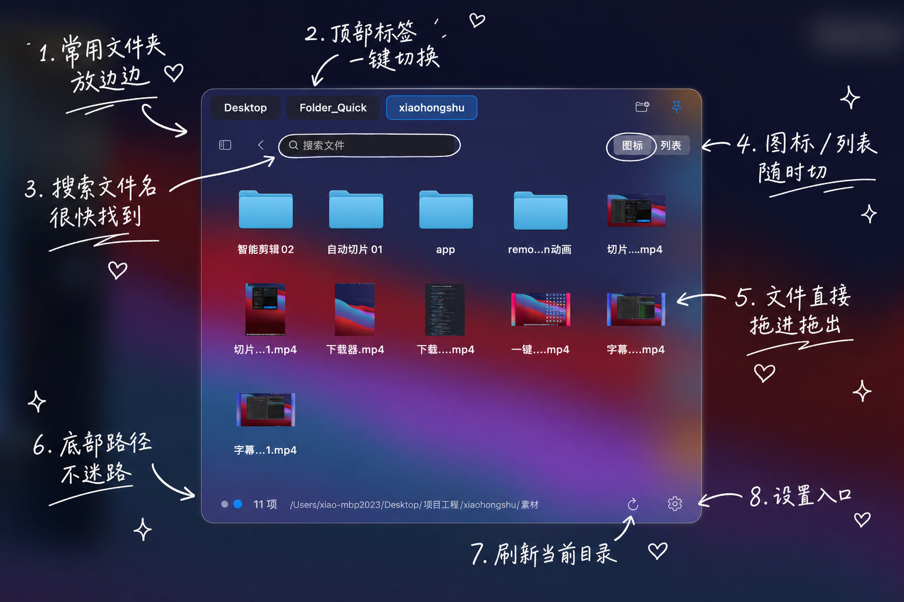
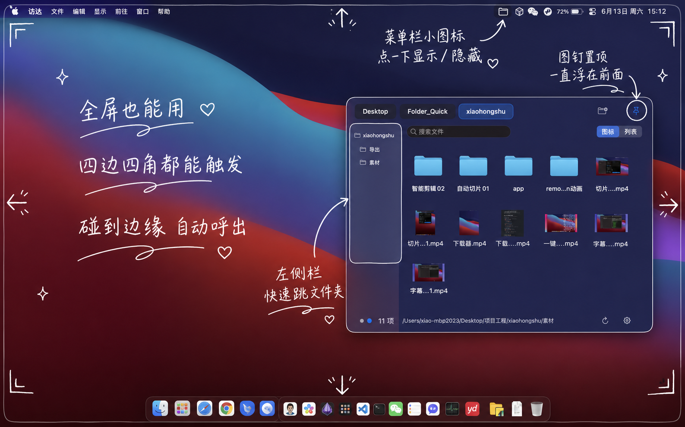
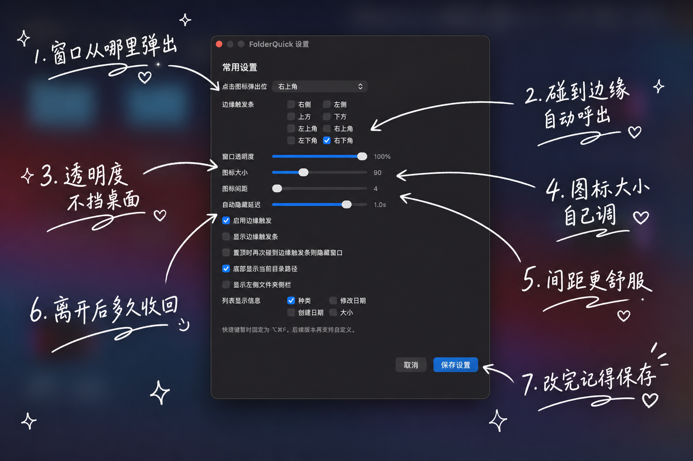

# FolderQuick

FolderQuick 是一款 macOS 菜单栏侧边文件工作台。它不替代访达，而是把常用文件夹放到一个随叫随到的窗口里，让找文件、预览文件、拖拽文件更快完成。

## 界面预览








## 当前状态

当前版本已经进入可日常试用阶段，重点能力包括：

- 顶部浏览器式文件夹标签页，支持切换、右键管理、拖动排序、长按移动。
- 每个标签会记住自己的目录层级，切换标签不会丢失当前位置。
- 图标视图和列表视图，支持文件夹进入、返回、层级小点快速跳转。
- 左侧文字目录侧栏，可快速进入子级文件夹。
- 文件右键菜单：在访达中显示、打开方式、重命名、复制路径、获取信息、删除到废纸篓、快速操作、置顶文件。
- 空白处右键菜单：新建文件夹、在访达中显示、排序、视图模式、侧栏开关、设置、进入终端。
- 支持外部文件拖入当前目录或指定文件夹，拖拽悬停 1 秒可自动进入下一级。
- 支持从 FolderQuick 拖出文件到微信、邮件、浏览器、设计软件等其他 App。
- 空格键使用系统 Quick Look 预览，预览打开时切换文件会同步更新。
- 复制、粘贴、删除、重命名、预览等快捷键尽量贴近访达习惯。
- 菜单栏图标左键显示/隐藏，右键打开菜单。
- 支持屏幕边缘触发、窗口置顶、透明度、图标大小、图标间距、底部路径显示等设置。
- 设置改为手动保存，并带本地日志，方便定位卡死或异常。

## 项目目录

```text
Folder_Quick/
├── README.md                 # 项目入口说明
├── docs/
│   ├── images/               # README 截图
│   ├── 使用说明.md            # 当前版本怎么用
│   └── 开发说明.md            # 构建、目录、日志和后续开发
├── releases/
│   └── changelog.md          # 版本更新记录
└── app/
    └── FolderQuick/          # macOS App 源码和 Xcode 工程
```

## 快速构建

推荐使用 Xcode 构建脚本：

```bash
cd app/FolderQuick
./build_xcode.sh
```

构建完成后应用在：

```text
app/FolderQuick/build/XcodeDerived/Build/Products/Release/FolderQuick.app
```

## 文档入口

- 当前版本用法：[docs/使用说明.md](./docs/使用说明.md)
- 构建和开发说明：[docs/开发说明.md](./docs/开发说明.md)
- 更新记录：[releases/changelog.md](./releases/changelog.md)

## 开源协议

本项目使用 MIT License，详见 [LICENSE](./LICENSE)。

## 近期待完善

- 自定义全局快捷键。
- 更完整的签名、打包和分发流程。
- 更接近访达的列宽记忆、排序细节和大文件拷贝体验。
